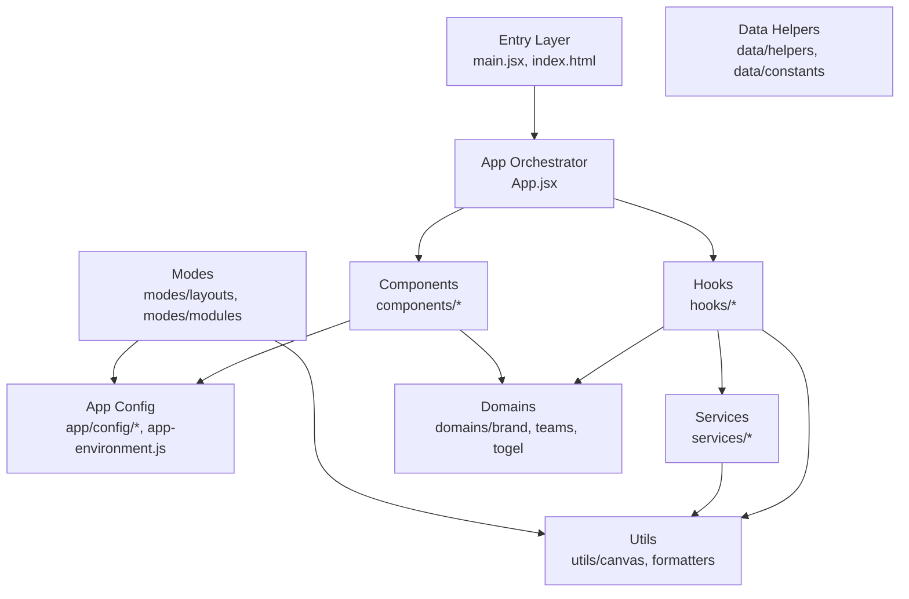

# Audit Awal: Struktur & Boundaries

## A) STRUKTUR LAYER (Folder → Peran)

Berdasarkan [`docs/ARCHITECTURE.md`](docs/ARCHITECTURE.md) dan analisis kode aktual:




### Layer Definitions (sesuai docs)

| Folder | Peran Aktual | Status ||--------|--------------|--------|| **src/app/** | Config aggregator & registry (AppEnvironment, mode-registry, config/modules) | ✅ Sesuai docs || **src/data/** | Helper functions & constants (match-factory, date-formatters, placeholders) | ✅ Sesuai docs || **src/domains/** | Domain-specific data sources (brand/assets, teams/logos, togel/data) | ✅ Sesuai docs || **src/utils/** | Pure utilities (canvas drawing, formatters, image-loader) | ✅ Sesuai docs || **src/modes/** | Mode layouts & modules (match-mode, togel-mode, raffle-mode) | ✅ Sesuai docs || **src/services/** | Orchestration services (banner-renderer, banner-exporter) | ✅ Sesuai docs || **src/hooks/** | Custom React hooks (state, domain, render, props builders) | ✅ Sesuai docs || **src/components/** | UI components (layout, forms dengan sub-sections) | ✅ Sesuai docs |

### Barrel Export Pattern

Sesuai [ARCHITECTURE.md section 2.5](docs/ARCHITECTURE.md), sistem menggunakan barrel exports:

- [`src/app/index.js`](src/app/index.js) — App configuration & constants
- [`src/hooks/index.js`](src/hooks/index.js) — Semua custom hooks
- [`src/components/index.js`](src/components/index.js) — Semua komponen UI
- [`src/utils/index.js`](src/utils/index.js) — Utilitas (formatter, dll)

**Temuan**: Barrel pattern diterapkan dengan baik, tapi `app/index.js` menjadi **mega-export** (lihat risiko #1).---

## B) DEPENDENCY DIRECTION (Siapa Boleh Import Siapa)

### Arsitektur Aktual (dari kode)

**Top → Down (allowed):**

```javascript
App.jsx
  ↓
Hooks (useRenderConfiguration, useBannerState, dll)
  ↓
Services (banner-renderer, banner-exporter)
  ↓
Utils/Canvas (drawing functions)
  
Components (MatchListForm)
  → AppEnvironment (direct import!)
  → Domains
  
Modes (layouts/match-mode)
  → AppEnvironment (direct import!)
  → Utils/Canvas
```

**Horizontal (peer-to-peer):**

```javascript
Domains ← → Data helpers (saat ini isolated)
Hooks ← → Domains (hooks consume domains)
```


### Pola Re-export Masif

[`src/app/index.js`](src/app/index.js) me-re-export dari **8+ sumber berbeda**:

```javascript
// app/index.js (lines 1-28)
export * from "./config/modules/assets/asset.constants";
export { resolveFooterSrcForBrand } from "./config/modules/assets/asset.resolvers";
export * from "./config/modules/match/match.constants";
export * from "./config/modules/togel/togel.utils";
export * from "./config/modules/mode/mode.config";
export * from "../domains/brand";
export * from "../domains/teams";
export * from "../domains/togel";
export * from "../utils/image-loader";
export * from "../data/helpers/match-factory";
export * from "./app-environment";
export * from "./mode-registry";
```

**Implikasi**: Semua konsumen `app/index.js` (termasuk `App.jsx`) secara tidak langsung depend on semua layer di bawahnya.---

## C) TEMUAN RISIKO & INDIKATORNYA

### 🚨 Risiko #1: God Module (`app/index.js`)

**Bukti:**

- File [`src/app/index.js`](src/app/index.js) me-re-export 28 exports dari 12 file berbeda
- Consumers seperti [`App.jsx`](src/App.jsx) import 28 named exports dari `./app/index.js`
- Re-export melintasi boundary: domains, data helpers, utils

**Indikator:**

- Perubahan di `domains/brand/assets.js` memaksa rebuild consumers `app/index.js`
- Test dependency tree melebar tanpa batas (test harus mock semua dependencies)
- **Tidak cukup data**: daftar lengkap import consumers dari `app/index.js` (gunakan `grep "from.*app/index" -r src/`)

**Dampak:**

- High coupling
- Slow HMR di Vite
- Circular dependency risk jika domains import balik ke app

---

### 🚨 Risiko #2: AppEnvironment Runtime Registry

**Bukti:**

- [`src/app/app-environment.js`](src/app/app-environment.js) adalah singleton dengan runtime registry
- Komponen [`MatchListForm.jsx`](src/components/MatchListForm.jsx) line 3: `import AppEnvironment from "../app/app-environment"`
- Modes [`layouts/match-mode.js`](src/modes/layouts/match-mode.js) line 1: `import AppEnvironment from "../../app/app-environment"`

**Indikator:**

- Implicit dependencies via `AppEnvironment.getGlobals()`, `getHook()`, dll
- Sulit trace dependency graph (dependency di runtime, bukan static)
- **Tidak cukup data**: siapa saja yang masih menggunakan `AppEnvironment.getGlobals()` vs import langsung dari modules (cek dengan `grep "getGlobals" -r src/`)

**Dampak:**

- Hard to test (perlu setup registry sebelum test)
- Circular dependency tersembunyi
- Runtime errors sulit di-debug

---

### 🚨 Risiko #3: Deep Imports ke `app/config/modules/`

**Bukti:**

- [`app/index.js`](src/app/index.js) import langsung dari `./config/modules/assets/asset.constants`, `./config/modules/match/match.config`, dll
- Struktur nested 3-level: `app/config/modules/togel/togel.utils.js`

**Indikator:**

- Consumers bisa bypass barrel dan import langsung: `import { X } from "../../app/config/modules/match/match.config"`
- Refactor internal modules memaksa update import di banyak file
- **Tidak cukup data**: apakah ada direct import ke `app/config/modules/*` dari luar `app/index.js`? (cek dengan `grep "app/config/modules" -r src/ --exclude-dir=app`)

**Dampak:**

- Leaky abstraction
- Sulit enforce boundary

---

### ⚠️  Risiko #4: Components Import AppEnvironment Langsung

**Bukti:**

- [`src/components/MatchListForm.jsx`](src/components/MatchListForm.jsx) line 3: `import AppEnvironment from "../app/app-environment"`
- Seharusnya components consume via props (dari hooks atau App.jsx)

**Indikator:**

- Boundary leak: Component layer seharusnya tidak tahu tentang app config layer
- Components jadi tidak pure (depend on runtime registry)
- **Tidak cukup data**: apakah semua component sections juga import AppEnvironment? (cek `components/match-form/sections/*.jsx`)

**Dampak:**

- Hard to test components in isolation
- Breaks unidirectional data flow

---

### ⚠️  Risiko #5: Utils/Canvas Tidak Pure

**Bukti:**

- [`src/utils/canvas/`](src/utils/canvas/) berisi drawing functions
- **Tidak cukup data**: apakah canvas utils import dari domains/app? (cek dengan `grep "from.*domains\|from.*app" src/utils/canvas/*.js`)

**Indikator (potensial):**

- Jika utils import dari upper layers → circular dependency
- Utils seharusnya pure (hanya terima params, tidak import business logic)

**Dampak (jika terjadi):**

- Utils tidak reusable
- Test sulit (harus mock app/domains)

---

## D) 3-5 BOUNDARIES MINIMAL (Phase 1)

### Rule #1: Ban Re-export Across Layers di `app/index.js`

**Aturan:**

- `app/index.js` HANYA boleh export dari `app/` folder (config, app-environment, mode-registry)
- **TIDAK** boleh re-export dari `domains/`, `data/`, `utils/`

**Implementasi:**

- Consumers yang butuh domains → import langsung: `import { AVAILABLE_BRAND_LOGOS } from "../../domains/brand"`
- Consumers yang butuh utils → import dari `utils/index.js` atau langsung

**Benefit:**

- Dependency graph jadi explicit
- Mempercepat HMR (perubahan di domains tidak trigger rebuild app/index.js)
- Kurangi god module risk

**Enforcement:**

- Eslint rule: `no-restricted-imports` untuk ban import lintas layer di barrel files

---

### Rule #2: Components Tidak Boleh Import AppEnvironment Langsung

**Aturan:**

- Semua component di `components/` (termasuk sub-folder) tidak boleh `import AppEnvironment`
- Data/config harus diterima via props dari `App.jsx` atau custom hooks

**Implementasi:**

- Refactor [`MatchListForm.jsx`](src/components/MatchListForm.jsx) untuk tidak import `AppEnvironment`
- Extract data ke props atau hook (sudah ada pattern `matchListFormEnv` di file tersebut)

**Benefit:**

- Components jadi pure & testable
- Enforce unidirectional data flow (App → Components)

**Enforcement:**

- Eslint rule: `no-restricted-imports` untuk ban `app-environment` di folder `components/`

---

### Rule #3: Ban Deep Import ke `app/config/modules/*` dari Luar `app/`

**Aturan:**

- Hanya `app/index.js` dan file di `app/` yang boleh import dari `app/config/modules/*`
- File di luar `app/` harus import via `app/index.js`

**Implementasi:**

- Audit existing deep imports (lihat section E)
- Refactor ke import dari barrel

**Benefit:**

- Internal structure `app/config/modules/` bisa di-refactor tanpa break consumers
- Enforce encapsulation

**Enforcement:**

- Eslint rule: `no-restricted-imports` dengan pattern `**/app/config/modules/**` untuk folder di luar `app/`

---

### Rule #4: Utils Harus Pure (No Import dari App/Domains/Data)

**Aturan:**

- Semua file di `utils/` tidak boleh import dari `app/`, `domains/`, `data/`, `hooks/`, `components/`, `modes/`, `services/`
- Utils hanya boleh import dari sesama `utils/` atau eksternal libraries

**Implementasi:**

- Audit `utils/` untuk import violations (lihat section E)
- Jika ada violation, extract logic atau pass via parameter

**Benefit:**

- Utils jadi reusable & framework-agnostic
- Test jadi mudah (no mocking)
- Clear dependency direction

**Enforcement:**

- Eslint rule: `no-restricted-imports` di folder `utils/` dengan pattern list upper layers

---

### Rule #5: Domains Harus Isolated (No Import antar Domain)

**Aturan:**

- `domains/brand/` tidak boleh import dari `domains/teams/` atau `domains/togel/`
- Jika ada shared logic → extract ke `data/helpers/` atau `utils/`

**Implementasi:**

- Audit cross-domain imports (lihat section E)
- Saat ini [sudah isolated berdasarkan docs PROGRESS.md](docs/PROGRESS.md) line 23

**Benefit:**

- Domain bisa dikembangkan independen
- Clear separation of concerns
- Mudah extract ke package terpisah (jika perlu)

**Enforcement:**

- Eslint rule: `no-restricted-imports` dengan pattern antar domain

---

## E) APA YANG HARUS DICEK BERIKUTNYA (Phase 2)

### 1. Import Graph Analysis (PRIORITAS TINGGI)

**Yang perlu dicek:**

```bash
# Siapa saja yang import app/index.js?
grep -r "from.*['\"].*app/index" src/ --exclude-dir=node_modules

# Apakah ada deep import ke app/config/modules dari luar app/?
grep -r "app/config/modules" src/ --exclude-dir=app --exclude-dir=node_modules

# Apakah ada components yang import AppEnvironment?
grep -r "AppEnvironment" src/components/ src/modes/

# Apakah utils import dari upper layers?
grep -rE "from.*(app|domains|data|hooks|components|modes|services)" src/utils/

# Apakah ada cross-domain imports?
grep -r "domains/brand" src/domains/teams/ src/domains/togel/
grep -r "domains/teams" src/domains/brand/ src/domains/togel/
grep -r "domains/togel" src/domains/brand/ src/domains/teams/
```

**Output:** Daftar violations per-rule dari section D---

### 2. AppEnvironment Usage Audit

**Yang perlu dicek:**

- File mana saja yang masih gunakan `AppEnvironment.getGlobals()` vs import langsung dari modules?
- Apakah ada runtime registration yang masih dipakai? (getHook, getComponent, registerModeLayout, dll)

**Cara:**

```bash
grep -r "getGlobals\|getHook\|getComponent\|registerHook\|registerComponent" src/ --exclude=app-environment.js
```

**Keputusan:** Apakah AppEnvironment masih diperlukan atau bisa diganti dengan static imports?---

### 3. Test Coverage untuk Boundary Rules

**Yang perlu dicek:**

- Apakah ada test yang mock `AppEnvironment`?
- Berapa % test coverage untuk files di `app/config/modules/*`?
- Apakah test components masih perlu setup registry?

**Cara:**

```bash
npm test -- --coverage
# Periksa coverage report untuk app/, domains/, utils/
```

**Keputusan:** Jika test sulit karena coupling → konfirmasi urgensi boundary enforcement---

### 4. Circular Dependency Detection

**Yang perlu dicek:**

- Apakah ada circular dependencies di build output?

**Cara:**

```bash
# Install madge
npm install -D madge

# Check circular deps
npx madge --circular --extensions js,jsx src/
```

**Output:** List circular dependencies (jika ada)---

### 5. Bundle Analysis (Optional)

**Yang perlu dicek:**

- Berapa ukuran bundle per-layer?
- Apakah `app/index.js` menyebabkan bloat?

**Cara:**

```bash
npm run build
npx vite-bundle-visualizer
```

**Output:** Visualisasi dependency tree dan bundle size---

## Summary

### ✅ Yang Sudah Baik

1. Barrel export pattern diterapkan konsisten
2. Domain isolation sudah dimulai (per PROGRESS.md)
3. Hooks sudah di-extract dengan baik dari App.jsx
4. Services layer terpisah jelas

### 🚨 Yang Perlu Action Segera

1. **app/index.js god module** → pecah re-exports lintas layer
2. **Components import AppEnvironment** → refactor ke props/hooks
3. **Audit import violations** → jalankan grep commands di section E1

### 📋 Boundaries Phase 1 (minimal & aman)

- Rule #1: Ban re-export lintas layer di app/index.js
- Rule #2: Components tidak import AppEnvironment
- Rule #3: Ban deep import ke app/config/modules
- Rule #4: Utils harus pure