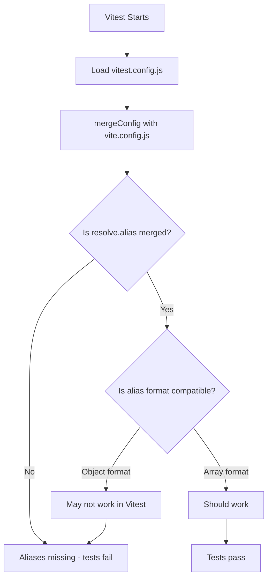

# Debug Vitest Alias Resolution

## Root Cause Hypothesis

Vitest is failing to resolve `@hooks/*`, `@data/*`, `@utils/*`, and `@domains/*` imports despite having aliases configured. The `mergeConfig` approach may not be merging `resolve.alias` correctly, or Vitest may require a different alias format.




## Step-by-Step Debugging Plan

### Step 1: Prove Which Config File Is Loaded

**Goal**: Confirm Vitest is reading [vitest.config.js](vitest.config.js).**Action**: Add a console.log at the top of [vitest.config.js](vitest.config.js) to prove it executes:

```javascript
import { defineConfig } from "vitest/config";
import { mergeConfig } from "vite";
import baseConfig from "./vite.config.js";

console.log("✅ vitest.config.js LOADED");
console.log("baseConfig.resolve.alias:", baseConfig.resolve?.alias);

export default defineConfig(
  mergeConfig(baseConfig, {
    test: {
      // ... existing config
    },
  })
);
```

**Verification Commands**:

```bash
npx vitest run --config vitest.config.js 2>&1 | findstr "vitest.config.js"
```

**Expected Output**: Should see `✅ vitest.config.js LOADED` and the alias object printed.**Decision Point**:

- If console.log doesn't appear → Config file is NOT being loaded (wrong path, syntax error)
- If console.log appears but alias is `undefined` → `mergeConfig` isn't preserving `resolve.alias`
- If console.log appears and alias is present → Continue to Step 2

---

### Step 2: Hardcode Aliases Directly in vitest.config.js

**Goal**: Test if hardcoded aliases work, isolating whether the issue is import/merge or format.**Action**: Replace [vitest.config.js](vitest.config.js) with hardcoded aliases (temporarily bypass `alias.config.js` and `mergeConfig`):

```javascript
import { defineConfig } from "vitest/config";
import react from "@vitejs/plugin-react";
import path from "node:path";
import { fileURLToPath } from "node:url";

const __dirname = path.dirname(fileURLToPath(import.meta.url));

export default defineConfig({
  plugins: [react()],
  resolve: {
    alias: {
      "@hooks/": path.resolve(__dirname, "src/hooks/"),
      "@hooks": path.resolve(__dirname, "src/hooks/index.js"),
      "@data/": path.resolve(__dirname, "src/data/"),
      "@data": path.resolve(__dirname, "src/data/index.js"),
      "@utils/": path.resolve(__dirname, "src/utils/"),
      "@utils": path.resolve(__dirname, "src/utils/index.js"),
      "@domains/": path.resolve(__dirname, "src/domains/"),
      "@domains": path.resolve(__dirname, "src/domains"),
    },
  },
  test: {
    include: ["src/**/*.test.{js,jsx}", "src/**/__tests__/**/*.{js,jsx}"],
    exclude: [
      "**/node_modules/**",
      "**/dist/**",
      "**/__tests__/test-utils.{js,jsx}",
      "**/__tests__/*-utils.{js,jsx}",
    ],
    environment: "jsdom",
    globals: true,
    setupFiles: "./src/setupTests.js",
  },
});
```

**Verification Commands**:

```bash
# Clear cache first
npx vitest --clearCache

# Run tests
npx vitest run --config vitest.config.js
```

**Decision Point**:

- If tests now pass → Root cause is **(b) alias import/export or mergeConfig issue**
- If tests still fail → Root cause is **(c) alias format incompatibility** (object vs array)

---

### Step 3: Test Array-Based Alias Format (If Step 2 Fails)

**Goal**: Vitest may require array format instead of object format.**Action**: If Step 2 still fails, convert hardcoded aliases to array format:

```javascript
resolve: {
  alias: [
    { find: "@hooks/", replacement: path.resolve(__dirname, "src/hooks/") },
    { find: "@hooks", replacement: path.resolve(__dirname, "src/hooks/index.js") },
    { find: "@data/", replacement: path.resolve(__dirname, "src/data/") },
    { find: "@data", replacement: path.resolve(__dirname, "src/data/index.js") },
    { find: "@utils/", replacement: path.resolve(__dirname, "src/utils/") },
    { find: "@utils", replacement: path.resolve(__dirname, "src/utils/index.js") },
    { find: "@domains/", replacement: path.resolve(__dirname, "src/domains/") },
    { find: "@domains", replacement: path.resolve(__dirname, "src/domains") },
  ],
},
```

**Verification Commands**:

```bash
npx vitest --clearCache
npx vitest run --config vitest.config.js
```

**Decision Point**:

- If tests pass → Vitest requires array format
- If tests still fail → Check individual file imports

---

### Step 4: Fix Helper File Exclusion

**Goal**: Ensure [src/hooks/__tests__/test-utils.js](src/hooks/__tests__/test-utils.js) is not treated as a test suite.**Current State**: The file contains helper functions (`createTestMatch`, `mockFetch`, etc.) with no `describe` or `it` blocks.**Action**: The `exclude` pattern is already correct:

```javascript
exclude: [
  "**/__tests__/test-utils.{js,jsx}",
  "**/__tests__/*-utils.{js,jsx}",
]
```

**Verification**: After Step 2 or 3 succeeds, confirm no "No test suite found" warning appears.**Alternative (if needed)**: Rename the file to `test-helpers.js` to make it more obvious it's not a test file.---

### Step 5: Refactor to Shared Alias Config

**Goal**: Once aliases work, refactor to a shared config file for DRY.**Action**: Create final architecture:

1. **[alias.config.js](alias.config.js)** - Single source of truth (use working format from Step 2 or 3)
2. **[vite.config.js](vite.config.js)** - Import and use shared alias
3. **[vitest.config.js](vitest.config.js)** - Import and use shared alias directly (NOT via mergeConfig)

**Final [vitest.config.js](vitest.config.js)**:

```javascript
import { defineConfig } from "vitest/config";
import react from "@vitejs/plugin-react";
import alias from "./alias.config.js";

export default defineConfig({
  plugins: [react()],
  resolve: {
    alias, // Use working format determined in Steps 2-3
  },
  test: {
    include: ["src/**/*.test.{js,jsx}"],
    exclude: [
      "**/node_modules/**",
      "**/dist/**",
      "**/__tests__/*-utils.{js,jsx}",
      "**/__tests__/test-utils.{js,jsx}",
    ],
    environment: "jsdom",
    globals: true,
    setupFiles: "./src/setupTests.js",
  },
});
```

**Verification Commands**:

```bash
# Clear cache
npx vitest --clearCache

# Run full test suite
npx vitest run

# Run via npm script
npm test

# Verify ESLint still works
npm run lint
```

---

## Root Cause Summary

Based on the debugging steps, the root cause will be one of:**A. Config not loaded**: [vitest.config.js](vitest.config.js) has syntax error or wrong path

- Fix: Correct syntax/path

**B. mergeConfig doesn't preserve resolve.alias**: Vite's `mergeConfig` may not deep-merge `resolve.alias` correctly

- Fix: Don't use `mergeConfig`; define config directly in vitest.config.js

**C. Alias format incompatibility**: Vitest requires array format instead of object format

- Fix: Use array format with `{ find, replacement }`

**D. ESM import timing**: Dynamic import of [alias.config.js](alias.config.js) fails at config load time

- Fix: Inline aliases or use CJS format

---

## Final Verification Checklist

After implementing the fix:

- [ ] `npx vitest run` passes all tests
- [ ] `npm test` passes
- [ ] No "Failed to resolve import" errors
- [ ] No "No test suite found" warnings for helper files