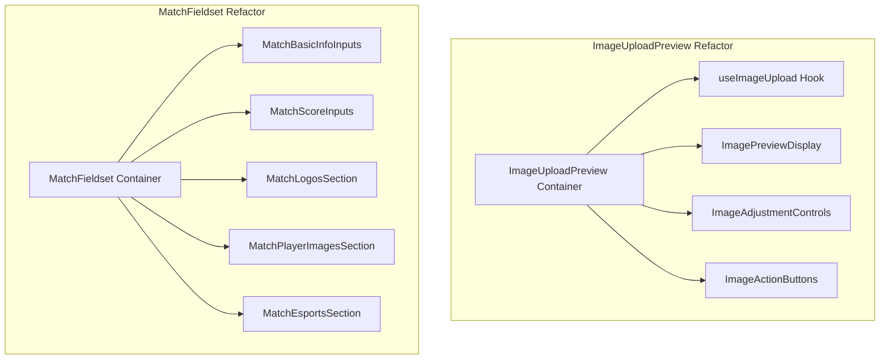

# Plan: Phase 1 - Refactor Komponen Besar

## Overview

Memecah 2 komponen besar menjadi sub-komponen modular:

- [`ImageUploadPreview.jsx`](src/components/match-form/ui/ImageUploadPreview.jsx) (379 lines) → 5 unit
- [`MatchFieldset.jsx`](src/components/match-form/sections/MatchesSection/MatchFieldset.jsx) (370 lines) → 6 unit

## Architecture



---

## Part A: Refactor ImageUploadPreview

### A1. Extract Custom Hook: useImageUpload

**File baru:** [`src/components/match-form/ui/hooks/useImageUpload.js`](src/components/match-form/ui/hooks/useImageUpload.js)**Tanggung jawab:**

- State management (loading, manualInput, inputStatus, requestIdRef)
- File upload logic
- Clipboard paste handling
- Manual URL/base64 input
- Reset functionality

**Exports:**

```javascript
{
  isLoading,
  manualInput,
  inputStatus,
  handleFileSelection,
  handleClipboardPaste,
  handleManualInputChange,
  handleReset
}
```

**Lines extracted:** 32-158 dari ImageUploadPreview.jsx---

### A2. Extract Component: ImagePreviewDisplay

**File baru:** [`src/components/match-form/ui/ImagePreviewDisplay.jsx`](src/components/match-form/ui/ImagePreviewDisplay.jsx)**Tanggung jawab:**

- Display preview dengan transformasi (scale, offset, flip)
- Clamping values
- Transform calculations

**Props:**

```javascript
{
  previewSrc,
  label,
  scale,
  offsetX,
  offsetY,
  isFlipped,
  slotHeight
}
```

**Lines extracted:** 177-186, 249-268---

### A3. Extract Component: ImageAdjustmentControls

**File baru:** [`src/components/match-form/ui/ImageAdjustmentControls.jsx`](src/components/match-form/ui/ImageAdjustmentControls.jsx)**Tanggung jawab:**

- Scale slider dengan percentage display
- Offset X/Y sliders

**Props:**

```javascript
{
  scale,
  offsetX,
  offsetY,
  onScaleChange,
  onOffsetChange
}
```

**Lines extracted:** 160-175, 270-311---

### A4. Extract Component: ImageActionButtons

**File baru:** [`src/components/match-form/ui/ImageActionButtons.jsx`](src/components/match-form/ui/ImageActionButtons.jsx)**Tanggung jawab:**

- Auto fetch button
- Reset button
- Flip button
- Remove background button

**Props:**

```javascript
{
  canAutoFetch,
  onAutoFetch,
  onReset,
  onToggleFlip,
  isFlipped,
  canRemoveBackground,
  onRemoveBackground,
  isRemovingBackground,
  removeBackgroundError
}
```

**Lines extracted:** 206-223, 313-338---

### A5. Refactor Main Component

**File diupdate:** [`src/components/match-form/ui/ImageUploadPreview.jsx`](src/components/match-form/ui/ImageUploadPreview.jsx)**Struktur baru:**

```javascript
import useImageUpload from './hooks/useImageUpload';
import ImagePreviewDisplay from './ImagePreviewDisplay';
import ImageAdjustmentControls from './ImageAdjustmentControls';
import ImageActionButtons from './ImageActionButtons';

const ImageUploadPreview = (props) => {
  const uploadState = useImageUpload({...});
  
  return (
    <div className="rounded-xl border...">
      {/* Header dengan label */}
      <ImageActionButtons {...} />
      {/* Upload zone + Preview */}
      <ImagePreviewDisplay {...} />
      {/* Adjustment sliders */}
      <ImageAdjustmentControls {...} />
      {/* Manual textarea */}
    </div>
  );
};
```

**Target size:** ~150 lines (dari 379)---

## Part B: Refactor MatchFieldset

### B1. Extract Component: MatchBasicInfoInputs

**File baru:** [`src/components/match-form/sections/MatchesSection/MatchBasicInfoInputs.jsx`](src/components/match-form/sections/MatchesSection/MatchBasicInfoInputs.jsx)**Tanggung jawab:**

- Team home input
- Team away input
- Date input
- Time input

**Props:**

```javascript
{
  index,
  match,
  onMatchFieldChange
}
```

**Lines extracted:** 82-153---

### B2. Extract Component: MatchScoreInputs

**File baru:** [`src/components/match-form/sections/MatchesSection/MatchScoreInputs.jsx`](src/components/match-form/sections/MatchesSection/MatchScoreInputs.jsx)**Tanggung jawab:**

- Score home input (numeric)
- Score away input (numeric)
- Input validation & normalization

**Props:**

```javascript
{
  index,
  match,
  onMatchFieldChange
}
```

**Lines extracted:** 59-66, 154-191---

### B3. Extract Component: MatchLogosSection

**File baru:** [`src/components/match-form/sections/MatchesSection/MatchLogosSection.jsx`](src/components/match-form/sections/MatchesSection/MatchLogosSection.jsx)**Tanggung jawab:**

- 2x ImageUploadPreview untuk home/away logos
- Auto logo fetch logic
- Background removal untuk logos

**Props:**

```javascript
{
  index,
  match,
  onMatchFieldChange,
  onAutoLogoRequest,
  onLogoAdjust,
  resolveAutoLogoSrc,
  onRemoveLogoBackground,
  logoBackgroundRemovalState,
  canUseBackgroundRemoval,
  readFileAsDataURL
}
```

**Lines extracted:** 192-237, menggunakan helper lines 68-75---

### B4. Extract Component: MatchEsportsSection

**File baru:** [`src/components/match-form/sections/MatchesSection/MatchEsportsSection.jsx`](src/components/match-form/sections/MatchesSection/MatchEsportsSection.jsx)**Tanggung jawab:**

- Game selector dropdown
- Game logo preview
- Game name handling

**Props:**

```javascript
{
  index,
  match,
  gameOptions,
  onMatchFieldChange
}
```

**Lines extracted:** 34-39, 41-49, 238-276---

### B5. Extract Component: MatchPlayerImagesSection

**File baru:** [`src/components/match-form/sections/MatchesSection/MatchPlayerImagesSection.jsx`](src/components/match-form/sections/MatchesSection/MatchPlayerImagesSection.jsx)**Tanggung jawab:**

- 2x ImageUploadPreview untuk home/away player images
- Flip toggle logic
- Background removal untuk players

**Props:**

```javascript
{
  index,
  match,
  onMatchFieldChange,
  onPlayerImageAdjust,
  onPlayerImageFlipToggle,
  onRemovePlayerBackground,
  playerBackgroundRemovalState,
  canUseBackgroundRemoval,
  readFileAsDataURL
}
```

**Lines extracted:** 277-336, menggunakan helper lines 68-71---

### B6. Refactor Main Component

**File diupdate:** [`src/components/match-form/sections/MatchesSection/MatchFieldset.jsx`](src/components/match-form/sections/MatchesSection/MatchFieldset.jsx)**Struktur baru:**

```javascript
import MatchBasicInfoInputs from './MatchBasicInfoInputs';
import MatchScoreInputs from './MatchScoreInputs';
import MatchLogosSection from './MatchLogosSection';
import MatchEsportsSection from './MatchEsportsSection';
import MatchPlayerImagesSection from './MatchPlayerImagesSection';

const MatchFieldset = (props) => {
  const { handlers, media, removalState } = useMatchForm();
  
  return (
    <fieldset className="rounded-xl...">
      <legend>Pertandingan {index + 1}</legend>
      
      <MatchBasicInfoInputs {...} />
      
      {showScoreInputs && <MatchScoreInputs {...} />}
      
      <MatchLogosSection {...} />
      
      {isEsportsMode && <MatchEsportsSection {...} />}
      
      {showBigMatchExtras && <MatchPlayerImagesSection {...} />}
    </fieldset>
  );
};
```

**Target size:** ~100 lines (dari 370)---

## Implementation Steps

### Step 1: Create Hook Folder

Buat folder `src/components/match-form/ui/hooks/`

### Step 2: Extract useImageUpload Hook

- Buat file baru dengan state & handlers
- Export hook dengan proper JSDoc
- Test isolation

### Step 3: Extract ImageUploadPreview Sub-components

Urutan: Display → Adjustment → Actions → Main refactor

### Step 4: Update ImageUploadPreview Imports

Update di [`MatchFieldset.jsx`](src/components/match-form/sections/MatchesSection/MatchFieldset.jsx)

### Step 5: Extract MatchFieldset Sub-components

Urutan: BasicInfo → Score → Logos → Esports → Players → Main refactor

### Step 6: Update Barrel Exports

Update [`src/components/match-form/ui/index.js`](src/components/match-form/ui/index.js)

### Step 7: Lint & Test

- Run `npm run lint`
- Run `npm run test`
- Manual testing di browser

---

## Success Criteria

1. ImageUploadPreview: 379 → ~150 lines
2. MatchFieldset: 370 → ~100 lines
3. Semua tests passing
4. Tidak ada linter errors
5. Fungsionalitas tetap sama (no breaking changes)
6. Props validation tetap lengkap

## Estimated Time

- Refactor ImageUploadPreview: 90 menit
- Refactor MatchFieldset: 60 menit
- Testing & fixes: 30 menit