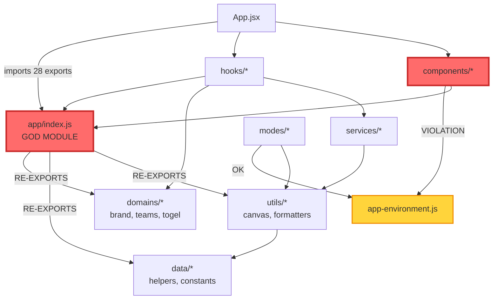
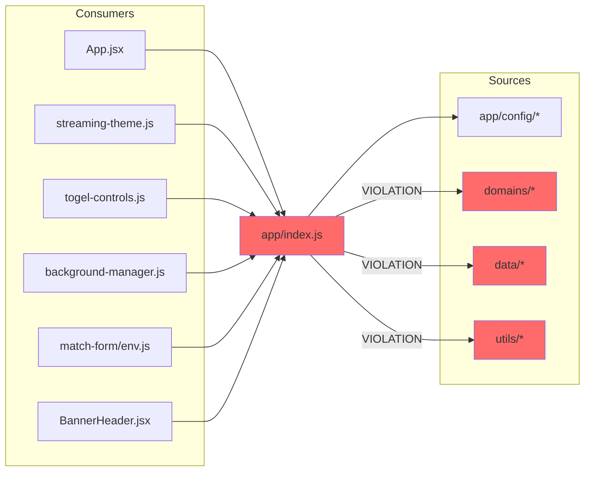
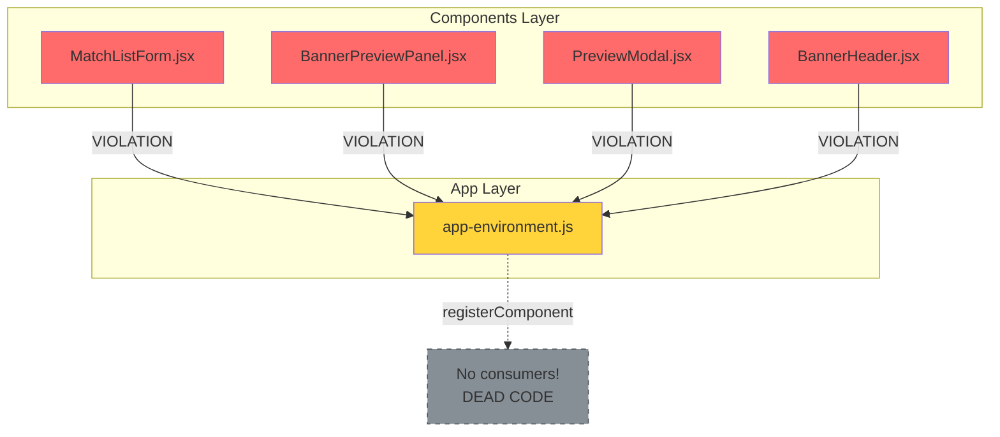
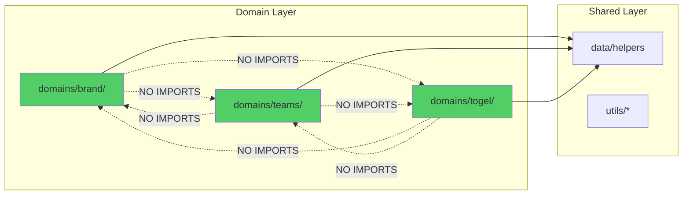
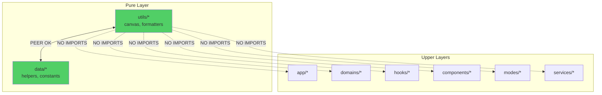
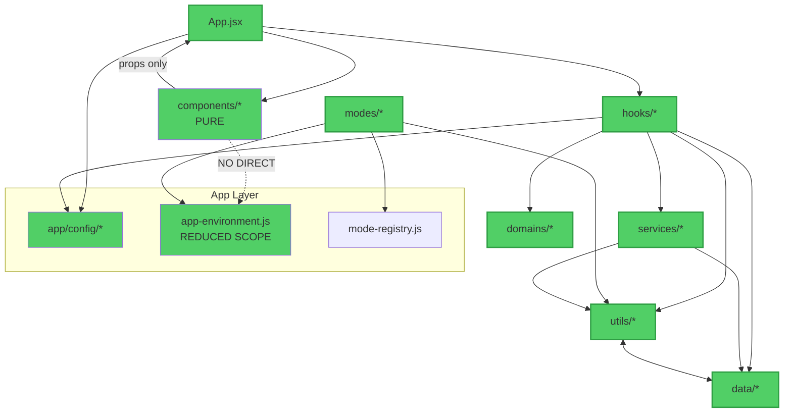

# Architecture Violations Visualization

This document visualizes the current state of the architecture, highlighting boundary violations discovered in the audit.

## Current Dependency Graph (With Violations)



**Legend**:
- 🔴 Red (Violation): Critical boundary violation
- 🟡 Yellow (Warning): Acceptable but needs attention
- 🟢 Green (OK): Compliant with rules

---

## Violation #1: God Module (`app/index.js`)



**Problem**: 6 consumers depend on 12+ sources indirectly

**Impact**:
- Change in `domains/brand/assets.js` → rebuilds `app/index.js` → rebuilds all 6 consumers
- Slow HMR during development
- Test dependency explosion

**Solution**: Remove cross-layer re-exports, force consumers to import directly

---

## Violation #2: Components Import AppEnvironment



**Problem**: Components reach up to app layer, breaking unidirectional data flow

**Impact**:
- Components not pure (depend on singleton)
- Hard to test in isolation
- Runtime dependency on registry

**Solution**: Remove `registerComponent` calls (dead code) and import `AppEnvironment` only where truly needed

---

## Compliant Architecture: Domains Isolated



**Status**: ✅ Compliant

**Verification**: 0 cross-domain imports found

**Benefit**: Each domain can be extracted to separate package if needed

---

## Compliant Architecture: Utils Pure (with Data Peer)



**Status**: ✅ Compliant (with clarification)

**Decision**: `data/` and `utils/` are peer layers (both pure utilities)

**Verification**: Utils only import from `data/` or external libraries

---

## Target Architecture (After Phase 2)



**Changes**:
1. ✅ Components no longer import AppEnvironment
2. ✅ app/config/* remains centralized but explicit
3. ✅ Consumers import directly from domains/data/utils
4. ✅ AppEnvironment scope reduced (only modes use it)

---

## Dependency Flow: Before vs After

### Before (Current - VIOLATED)

```
App.jsx
  → app/index.js (28 exports)
      → app/config/* (✅ OK)
      → domains/* (🔴 VIOLATION)
      → data/* (🔴 VIOLATION)
      → utils/* (🔴 VIOLATION)
```

**Transitive Dependencies**: Every consumer of `app/index.js` depends on ALL layers

### After (Target - COMPLIANT)

```
App.jsx
  → app/config/* (direct, explicit)
  → domains/* (direct, explicit)
  → data/* (direct, explicit)
  → utils/* (direct, explicit)
```

**Transitive Dependencies**: Each import is explicit, no hidden coupling

---

## Impact Analysis

### Current State Metrics

| Metric | Value | Status |
|--------|-------|--------|
| Files in violation | 11 | 🔴 High |
| Cross-layer re-exports | 5 | 🔴 High |
| Dead registration calls | 7 | 🟡 Medium |
| Indirect dependencies | Unknown | 🔴 High |
| HMR rebuild scope | Large | 🔴 High |

### Target State Metrics (After Phase 2)

| Metric | Target | Expected |
|--------|--------|----------|
| Files in violation | 0 | ✅ Clean |
| Cross-layer re-exports | 0 | ✅ Clean |
| Dead registration calls | 0 | ✅ Clean |
| Indirect dependencies | Explicit | ✅ Visible |
| HMR rebuild scope | Minimal | ✅ Fast |

---

## Files Requiring Changes

### Phase 2A: Remove Dead Code (7 files)

- [ ] `src/components/MatchListForm.jsx` (remove lines 3, 310)
- [ ] `src/components/layout/BannerPreviewPanel.jsx` (remove lines 2, 75)
- [ ] `src/components/layout/PreviewModal.jsx` (remove lines 2, 47)
- [ ] `src/components/layout/BannerHeader.jsx` (remove lines 2, 79)
- [ ] `src/hooks/background-manager.js` (remove line 114)
- [ ] `src/hooks/streaming-theme.js` (remove line 59)
- [ ] `src/hooks/togel-controls.js` (remove line 125)

### Phase 2B: Fix Component Config (2 files)

- [ ] `src/components/layout/BannerHeader.jsx` (receive MODE_CONFIG via props)
- [ ] `src/App.jsx` (pass MODE_CONFIG to BannerHeader)

### Phase 2C: Split Barrel Exports (7 files)

- [ ] `src/app/index.js` (remove 5 cross-layer re-exports)
- [ ] `src/App.jsx` (update imports, split by source)
- [ ] `src/hooks/streaming-theme.js` (update imports)
- [ ] `src/hooks/togel-controls.js` (update imports)
- [ ] `src/hooks/background-manager.js` (update imports)
- [ ] `src/components/match-form/env.js` (update imports)
- [ ] `src/components/layout/BannerHeader.jsx` (update imports)

**Total Files to Change**: 11 unique files (some appear in multiple phases)

---

## Risk Assessment

### Low Risk ✅

- Removing dead code (no consumers)
- Adding ESLint rules (preventive only)
- Documentation updates

### Medium Risk ⚠️

- Splitting barrel exports (requires careful testing)
- Component prop refactoring (needs validation)

### High Risk 🔴

- None identified (architecture is sound)

### Mitigation Strategy

1. Atomic commits per phase
2. Test after each phase
3. Keep old code in git history
4. Rollback plan documented

---

## Success Visualization

### Before: Tangled Dependencies

```
     app/index.js
    /  |   |   \
   /   |   |    \
  H₁  H₂  H₃   C₁ C₂
   \   |   |   /
    \  |   |  /
     domains
        |
      utils
        |
      data
```

All consumers tangled through god module

### After: Clean Layers

```
App.jsx
  ├─ app/config
  ├─ hooks
  │   ├─ domains
  │   ├─ utils
  │   └─ data
  └─ components (pure, props only)
```

Clear dependency hierarchy, explicit imports

---

## References

- Full audit findings: `docs/AUDIT-REPORT.md`
- Implementation guide: `docs/BOUNDARY-ENFORCEMENT.md`
- Execution summary: `docs/AUDIT-SUMMARY.md`
- Progress log: `docs/PROGRESS.md`

---

**Document Status**: Audit Complete, Ready for Implementation  
**Last Updated**: 2026-01-02  
**Next Review**: After Phase 2 implementation

